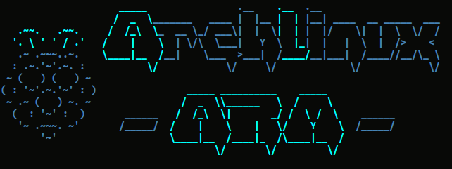

# archlinux-arm-motd
Messaggio del giorno personalizzato per il login in Archlinux ARM su
Raspberry Pi.

## Installazione
Nella seguente sezione, con il simbolo `$` si intende il normale prompt, mentre
con `#` si vuole indicare un root prompt.

1.	Clonare questo repo nella propria home su Raspberry Pi

		$ git clone https://github.com/mircobe87/archlinux-arm-motd.git

2.	Entrare nel repo clonato:
	
		$ cd archlinux-arm-motd

3.	Copiare il messaggio del giorno personalizzato del sistema creando prima
	una copia di backup del messaggio di default:

		# mv /etc/motd /etc/motd.backup
		# cp src/motd /etc/
